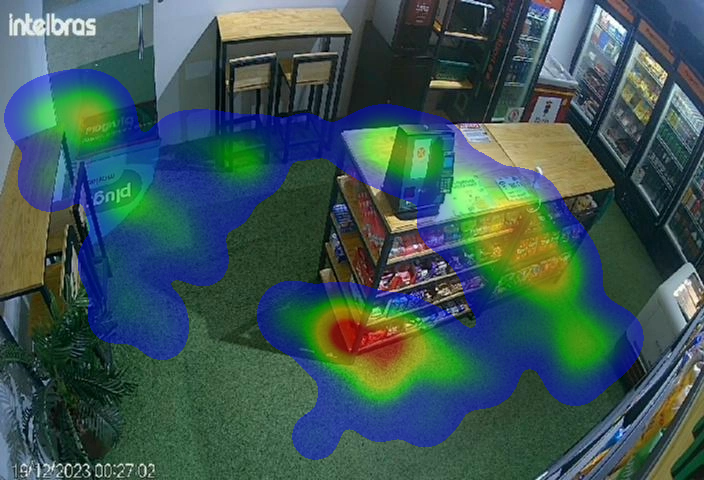

# Heatmap Overlay API

Este é o resultado do desafio de IA Noleak Defence

## Sobre

Esta API recebe uma imagem e um arquivo JSON contendo dados de detecção de pessoas e retorna a imagem com um heatmap sobreposto, destacando as áreas com maior concentração de pessoas. O heatmap utiliza um gradiente de cores personalizado (azul → verde → amarelo → laranja → vermelho) para representar a densidade de detecções.

## Instalação

1. Clone o repositório:
   ```bash
   git clone https://github.com/seu-usuario/heatmap-overlay-api.git
   cd heatmap-overlay-api
   ```

2. Crie e ative um ambiente virtual (opcional mas recomendado):
   ```bash
   python -m venv venv
   source venv/bin/activate  # Linux/Mac
   # ou
   venv\Scripts\activate     # Windows
   ```

3. Instale as dependências:
   ```bash
   pip install -r requirements.txt
   ```

4. Execute a API:
   ```bash
   uvicorn api_main:app --reload
   ```

A API estará disponível em `http://localhost:8000`.

## Exemplo de Imagem de Saída



*Imagem mostra áreas com maior concentração de pessoas em tons quentes (vermelho/laranja) e áreas com menor concentração em tons frios (azul/verde).*

## Requisitos

- Python 3.10.16
- Dependências principais:
  - FastAPI
  - OpenCV
  - NumPy
  - SciPy
  - Uvicorn (para execução do servidor)

## Testes

O projeto inclui testes automatizados para garantir a qualidade do código. Para executar os testes:

1. Instale as dependências de desenvolvimento:
   ```bash
   pip install pytest
   ```

2. Execute os testes:
   ```bash
   pytest test_api.py -v
   ```

Os testes verificam:
- Processamento bem-sucedido de imagens e JSON
- Tratamento de erros para arquivos inválidos
- Limites de tamanho de arquivo
- Formato de saída correto
- Detecção de casos sem pessoas no JSON

Para testar manualmente a API, você pode usar o endpoint `/generate-overlay` com:
- Método: POST
- Parâmetros:
  - `image`: arquivo de imagem (JPG/PNG)
  - `json_data`: arquivo JSON com detecções no formato especificado

Exemplo com cURL:
```bash
curl -X POST -F "image=@image.png" -F "json_data=@response.json" http://localhost:8000/generate-overlay --output result.png
```
